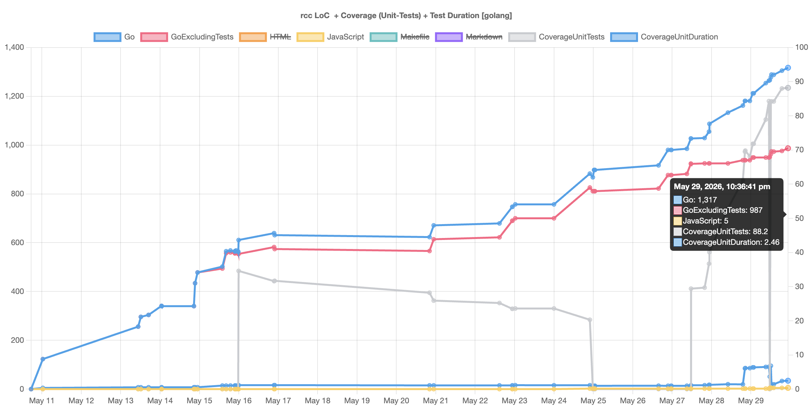

# rcc (retrospective code coverage + lines of code)

rcc can be used to create a graph/plot of test coverage and LoC data based on
a project's git commit history. Graph data is gathered by walking the
commit history, cloning each commit into a temporary directory and running
LoC and/or unit and/or integration tests on the cloned worktree.

It supports (and tries to auto-detect) few built-in programming languages
and their commonly used coverage tools. For other languages or different needs,
relevant commands to obtain coverage can be provided by the user. Same applies
to regex used to extract coverage value from test output - regexes documented
by [gitlab](https://docs.gitlab.com/ci/testing/code_coverage/coverage_reporting/#coverage-regex-patterns)
should generally work.

Currently [built-in support](languages.go):
- Go (`go test` for unit tests, `go test -tags=integration` for integration tests)
- Python (`pytest` / [pytest-cov](https://pypi.org/project/pytest-cov/))
- Java (Gradle / jacoco)

Dependencies for integration tests should possibly be started before running rcc.
Alternatively, built-in defaults can be overridden by specifying custom commands
for test execution.

By default, five parallel workers will be spawned to run analysis in parallel.
In theory, this should work well for unit tests. For integration tests, it's
more likely that rcc should be limited to a single worker (see usage below).

rcc supports multiple output formats for gathered data:
- HTML (embeds a bundled [chartjs](https://www.chartjs.org/), or links to it).
- PNG requires [gnuplot](http://www.gnuplot.info/) to be installed.
- JSON (using the chartjs dataset structure); raw data, no plot.
Output format is determined by the filename (extension) given for output, which
defaults to `rcc-output.html`.

## installation

No binary release available (yet?). Go required.

```bash
go install github.com/schnoddelbotz/rcc@main
```

## usage

First argument to `rcc` is a path to the project (under git version control) to be analyzed.
Without that argument, the current working directory will be analyzed.

Assuming a Go project in current working directory, to run LoC and unit test coverage, run
```bash
rcc
```

Example output for the first month of rcc's own repository history (browser screenshot):



This will produce the default graph format (`rcc-output.html`).
Should the project language not be specified and auto-detection fail, `rcc` will only analyse LoC.

Overview of currently supported flags to influence `rcc` behaviour (`rcc --help`):

```
Flags:
  -E, --commits-every int              Only look at every Nth commit (default 1)
  -A, --commits-from time              Look at commits since date (default 0)
  -Z, --commits-to time                Look at commits until date (default Now)
  -I, --cover-integration              Run integration tests
  -X, --cover-integration-cmd string   Command for running integration tests
  -R, --cover-regex string             Regex for coverage value extraction
  -C, --cover-unit-cmd string          Command for running unit tests
  -d, --debug                          Enable debug output
  -J, --html-no-embed-chartjs          Don't embed ChartJS into generated .html
  -j, --html-no-embed-json             Don't embed JSON into generated .html
  -i, --include-languages strings      Explicitly list languages for LoC
  -l, --language string                Set project language (default autodetect)
  -D, --no-cover-duration              Don't graph coverage duration
  -U, --no-cover-unit                  Don't run unit tests
  -O, --open                           Open --output file upon completion
  -o, --output string                  Output file (default "rcc-output.html")
  -s, --skip-autodetect                Disable language auto detection
  -T, --timestamps                     Timestamp console log output
  -t, --tmp string                     Temporary work directory (default OS tmp)
  -v, --version                        Print rcc version and exit
  -w, --workers int                    Number of workers (default 5)
```

More usage examples:
```bash
# analyse the project at given path, open the graph in PNG format upon completion,
# also run integration tests and only analyse (and graph) LoC for given languages:
rcc -OIi Go,JavaScript,HTML -o my.png /path/to/my/project

# analyse one year of commits, only analyse every 100th commit, run no unit tests
rcc -A 2025-01-01 -Z 2025-12-31 -E 100 -U
```

## libraries used / dependencies

- [go-git](https://github.com/go-git/go-git) for all git operations
- [gocloc](https://github.com/hhatto/gocloc) to get LoC data
- [pflag](https://github.com/spf13/pflag) CLI command line interface

- [Chart.js](https://www.chartjs.org/) embedded, for HTML graphs
  - [chartjs-adapter-moment](https://github.com/chartjs/chartjs-adapter-moment) embedded, for time scale
  - [Moment.js](https://momentjs.com/) embedded, for readable dates / time scale

## background & related tools

rcc was originally born in 2025 as shell script (using gnuplot and gocloc), to monitor development of a single project.
Primary goal of the re-implentation in Go was to (have fun and) make it more universally usable and faster.
Both were created with the intension to sensitize (co-)devs to maintenance cost vs LoC and importance of test coverage.

There are obviously many similar tools out there, offering different perspectives; I first heard
about scc when reading [55,041,902 Lines of Code](https://planet.kde.org/cornelius-schumacher-2026-05-17-55-041-902-lines-of-code/).
The [scc](https://github.com/boyter/scc#background) project has an extensive list of similar projects.
You may want to take a look at scc itself for git insight reports, which rcc does not offer in that form.

## status / todo

Fun project, WIP. Open tasks:

- [ ] fix: --branch option required; uses hard-coded "main" :/
- [ ] add --list-languages / gocloc + rcc (auto-detect -> test commands)
- [ ] add option to disable LoC
- [ ] add cli flag: output png dimensions
- [ ] add JSON --append mode, to extend an exist json ouput file (/w 1 or more commits, based on range)

## license

MIT
